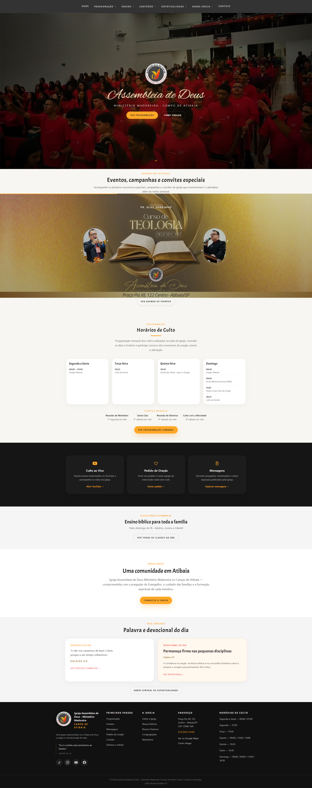
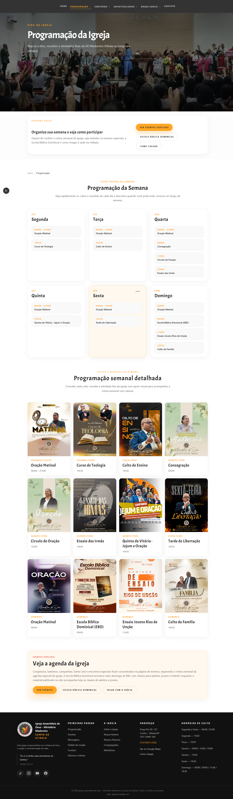
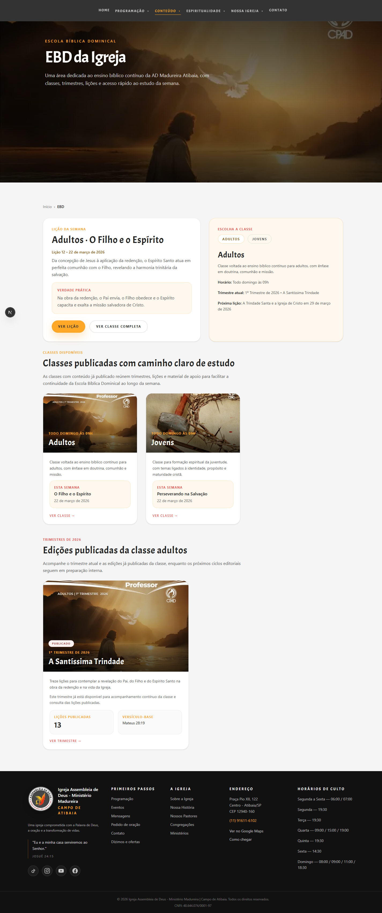
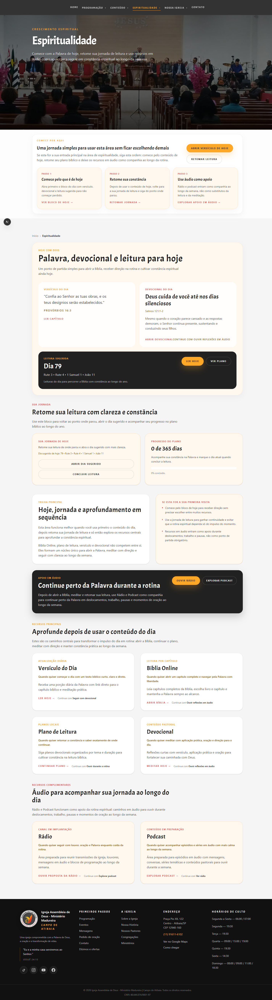
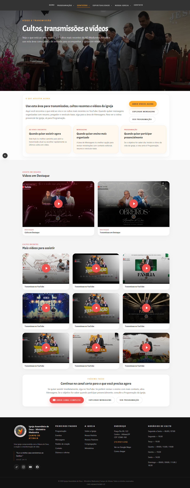

# AD Madureira Atibaia — Digital Church Platform


Website institucional e hub espiritual digital da **Igreja Assembleia de Deus – Ministério Madureira (Campo de Atibaia)**.

Desenvolvido com **Next.js, React, TypeScript e TailwindCSS**, com foco em performance, SEO, organização de conteúdo e experiência mobile-first.

Além da presença institucional, a aplicação funciona como um **hub espiritual digital**, reunindo Bíblia online, devocionais, EBD, agenda, mensagens e canais de contato em um único ponto de acesso.

---

## 🌐 Produção

**[admadureiraatibaia.com.br](https://admadureiraatibaia.com.br)**

## 🏠 Home



---

## 🎯 Problema

Grande parte das igrejas brasileiras concentra sua comunicação exclusivamente em redes sociais, o que gera:

- informações dispersas e de difícil acesso
- programação sem organização centralizada
- ausência de recursos espirituais de fácil consulta
- baixa acessibilidade para visitantes e novos membros

---

## 💡 Solução

Plataforma digital que centraliza:

- programação semanal da igreja
- agenda de eventos especiais
- conteúdos bíblicos e devocionais
- materiais da Escola Bíblica Dominical
- mensagens e estudos
- histórico e identidade institucional
- canais diretos de contato, oração e localização

---

## ✨ Funcionalidades

### 📅 Programação Semanal
Exibição estruturada da rotina da igreja: cultos, oração matinal, EBD, campanhas e reuniões ministeriais.

### 📆 Agenda de Eventos
Sistema separado da programação fixa para eventos especiais: congressos, cultos especiais, campanhas temáticas e eventos do campo de Atibaia.

### 📖 Hub de Espiritualidade
Área dedicada ao crescimento espiritual diário: Bíblia online, versículo do dia, devocionais, plano de leitura e rádio cristã.

### 🎓 Escola Bíblica Dominical (EBD)
Lições semanais, resumos, materiais de apoio e versão para impressão — para adultos, jovens e infantil.

### 🎥 Mensagens
Biblioteca de conteúdos espirituais: vídeos, reflexões e estudos bíblicos.

### 🤝 Ministérios
Apresentação dos ministérios da igreja com informações e formas de contato.

### 🙏 Pedidos de Oração e Contato
Canal direto entre membros, visitantes e a liderança da igreja.

---

## 📸 Preview

### Programação


### EBD


### Espiritualidade


### Conteúdo e vídeos


---

## 🧠 Arquitetura

```text
src/
  app/          rotas e páginas (Next.js App Router)
  components/   componentes reutilizáveis de UI
  sections/     blocos estruturais de páginas
  data/         conteúdo e dados institucionais
  lib/          utilitários, helpers e regras de negócio
  hooks/        hooks personalizados
```

Separação clara entre interface, conteúdo, lógica e utilitários. Ver [docs/architecture.md](docs/architecture.md) para detalhes.

---

## ⚙️ Stack

| Camada | Tecnologia |
|---|---|
| Framework | Next.js (App Router) |
| UI | React + TailwindCSS |
| Linguagem | TypeScript |
| Deploy | Vercel |
| Integração de mídia | YouTube Data API |

---

## 🛠️ Rodando localmente

```bash
# Clone o repositório
git clone https://github.com/JrValerio/admadureira-atibaia

# Entre no diretório
cd admadureira-atibaia

# Instale as dependências
npm install

# Crie o arquivo de variáveis de ambiente
cp .env.example .env.local

# Execute em modo de desenvolvimento
npm run dev
```

Acesse `http://localhost:3000`.

---

## 🔒 Variáveis de ambiente

| Variável | Descrição |
|---|---|
| `NEXT_PUBLIC_SITE_URL` | URL canônica do site em produção |
| `YOUTUBE_API_KEY` | Chave da YouTube Data API |
| `YOUTUBE_CHANNEL_ID` | ID do canal no YouTube (opcional se o canal padrão for usado) |
| `YOUTUBE_CHANNEL_HANDLE` | Handle do canal (ex: `@ADMadureiraAtibaia`) |
| `YOUTUBE_MESSAGES_PLAYLIST_ID` | Playlist oficial de Mensagens (opcional; há valor padrão no projeto) |
| `YOUTUBE_TESTIMONIALS_PLAYLIST_ID` | Playlist oficial de Testemunhos (opcional; há valor padrão no projeto) |

---

## 📚 EBD — Escopo editorial

O projeto mantém estrutura editorial por trimestre e classe, com conteúdo publicado de forma progressiva conforme governança interna.

Situação atual do repositório:

- **Adultos** — acervo estruturado por trimestre em 2026
- **Jovens** — acervo estruturado por trimestre em 2026
- **Infantil** — arquitetura mantida, com foco editorial atual no 1º trimestre de 2026
- materiais em preparação podem existir internamente sem exposição pública imediata

A publicação no front segue critérios de revisão, disponibilidade de material de apoio e decisão editorial do projeto.

Ver [docs/ebd-governance.md](docs/ebd-governance.md) para regras de publicação, rascunho e governança.

---

## 🧭 Roadmap

Ver [docs/roadmap.md](docs/roadmap.md) para o planejamento de evoluções.

---

## 📍 Igreja

**Assembleia de Deus – Ministério Madureira**
Praça Pio XII, 122 – Centro – Atibaia/SP

[Instagram](https://www.instagram.com/admadureira_atibaia/) · [YouTube](https://www.youtube.com/@ADMadureiraAtibaia)

---

## 📄 Licença

Uso institucional da igreja. Avalie a política de conteúdo e direitos antes de redistribuir textos, imagens, materiais editoriais ou conteúdos de terceiros.
